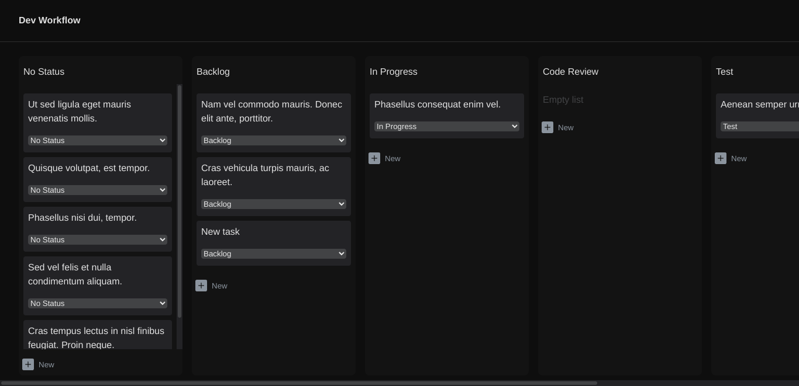

[](https://danilocdesousa.github.io/software-development-workflow/)

# Software Development Workflow

Projeto de fluxo de trabalho tipo Kanvas baseado no curso React para Iniciantes | Udemy

## Tabela de conteúdo

<!--ts-->
   - [Tecnologias](#tecnologias)
   - [Pré-requisitos](#pré-requisitos)
   - [Instalação](#instalação)
   - [Como usar](#como-usar)
   - [Screenshots](#screenshots)
   - [Status](#status)
   - [Contribuição](#contribuição)
   - [Autor](#autor)
   - [Licença](#licença)
<!--te-->
 
## Tecnologias

As seguintes ferramentas foram usadas na construção do projeto:

- [React](https://pt-br.reactjs.org/)
- [Node.js](https://nodejs.org/en/)

## Pré-requisitos

Antes de começar, você precisará ter as seguintes ferramentas instaladas em sua máquina:

- [VSCode](https://code.visualstudio.com/) (recomendado)
- [Node.js](https://nodejs.org/en/)
- [Git](https://git-scm.com)

## Instalação

No diretório do projeto, você pode executar:

```
npm install
```

## Como usar

Para executar o aplicativo, no diretório do projeto, você pode executar:

```
npm start
```

Inicie o aplicativo no modo de desenvolvimento. Abra [http://localhost:3000](http://localhost:3000) para visualizá-lo em seu navegador.


## Screenshots

- Dev Workflow



## Status

Concluído ✅

## Contribuição
Pull requests não estão sendo aceitos no momento.

## Autor

Desenvolvido por [Danilo de Sousa](https://www.linkedin.com/in/danilocdesousa/)

## Licença

[MIT](https://choosealicense.com/licenses/mit/)
